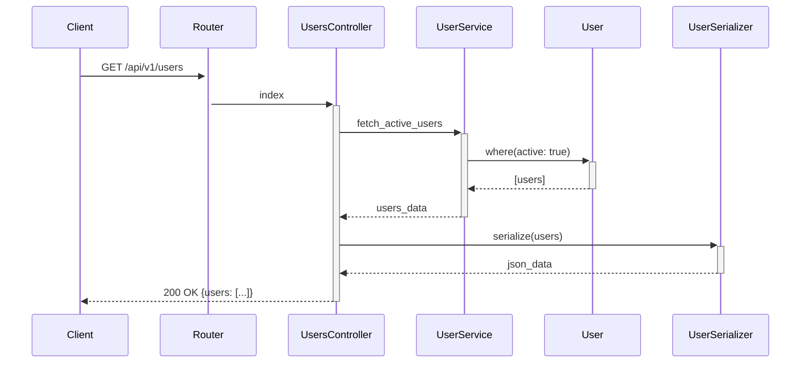

# 🚀 今後追加可能な可視化形式

RailsFlowMapに追加できる、ユーザーが希望しそうな図表示形式の提案です。

## 📊 1. **ERD (Entity Relationship Diagram)**

### 用途
- データベーススキーマの可視化
- テーブル間の関係を詳細に表示
- カラム名、型、インデックスを含む

### 想定される実装
```ruby
# 出力例
RailsFlowMap.export(graph, format: :erd, output: 'doc/erd.png')
```

### サンプル形式
```
┌─────────────────────┐
│      users          │
├─────────────────────┤
│ id         :integer │
│ name       :string  │
│ email      :string  │
│ created_at :datetime│
└─────────────────────┘
          ║
          ║ has_many
          ▼
┌─────────────────────┐
│      posts          │
├─────────────────────┤
│ id         :integer │
│ user_id    :integer │
│ title      :string  │
│ body       :text    │
└─────────────────────┘
```

## 🌐 2. **Interactive HTML/D3.js**

### 用途
- ブラウザで動的に操作可能な図
- ズーム、パン、ノードクリックで詳細表示
- 検索・フィルタリング機能

### 想定される実装
```ruby
RailsFlowMap.export(graph, format: :d3js, output: 'doc/interactive.html')
```

### 機能例
- ノードをドラッグして配置変更
- クリックで関連ノードをハイライト
- 検索ボックスで特定のモデル/コントローラーを探す
- エッジの表示/非表示切り替え

## 📈 3. **Metrics Dashboard (メトリクス可視化)**

### 用途
- コードの複雑度を可視化
- 依存関係の数を表示
- ホットスポット（変更頻度の高い箇所）の特定

### 想定される実装
```ruby
RailsFlowMap.analyze_metrics(
  include_complexity: true,
  include_dependencies: true,
  format: :dashboard
)
```

### 表示内容
```
📊 Rails Application Metrics
━━━━━━━━━━━━━━━━━━━━━━━━━━━
🏆 Most Complex Controllers:
  1. UsersController     (複雑度: 85)
  2. PostsController     (複雑度: 72)
  3. CommentsController  (複雑度: 45)

🔗 Most Dependencies:
  1. User model      (依存: 12)
  2. Post model      (依存: 8)
  3. Comment model   (依存: 6)

⚠️  Circular Dependencies Found: 2
```

## 🗺️ 4. **API Blueprint / OpenAPI (Swagger)**

### 用途
- API仕様書の自動生成
- エンドポイント、パラメータ、レスポンスの文書化
- Postman/Insomnia連携

### 想定される実装
```ruby
RailsFlowMap.export(
  graph, 
  format: :openapi, 
  output: 'doc/api_spec.yaml'
)
```

### 出力例
```yaml
openapi: 3.0.0
paths:
  /api/v1/users:
    get:
      summary: List all users
      responses:
        '200':
          description: Successful response
          content:
            application/json:
              schema:
                type: array
                items:
                  $ref: '#/components/schemas/User'
```

## 🎯 5. **Sequence Diagram (シーケンス図)**

### 用途
- リクエスト処理の時系列フロー
- メソッド呼び出しの順序を可視化
- 非同期処理やコールバックの表示

### 想定される実装
```ruby
RailsFlowMap.export(
  graph, 
  format: :sequence, 
  endpoint: '/api/v1/users',
  output: 'doc/user_flow_sequence.md'
)
```

### Mermaid形式の出力例


## 📱 6. **Mobile-Friendly SVG**

### 用途
- レスポンシブな図表示
- モバイルデバイスでの閲覧最適化
- タッチ操作対応

### 想定される実装
```ruby
RailsFlowMap.export(
  graph,
  format: :responsive_svg,
  viewport: :mobile,
  output: 'doc/mobile_flow.svg'
)
```

## 🎨 7. **Architecture Decision Records (ADR)**

### 用途
- アーキテクチャの決定事項を文書化
- なぜその構造になったかの記録
- 技術的負債の可視化

### 想定される実装
```ruby
RailsFlowMap.generate_adr(
  analyze_patterns: true,
  suggest_improvements: true,
  output: 'doc/architecture/'
)
```

### 出力例
```markdown
# ADR-001: Service Layer Pattern

## Status
Accepted

## Context
The application has grown to 50+ models with complex business logic.

## Decision
Implement service objects for business logic separation.

## Detected Pattern
- UserService handles user-related operations
- PostService manages post lifecycle
- Clear separation of concerns

## Suggestions
- Consider extracting NotificationService
- Add error handling layer
```

## 💡 8. **VS Code / IDE Integration**

### 用途
- エディタ内でリアルタイム可視化
- コード変更時の影響範囲表示
- ナビゲーション支援

### 想定される機能
- サイドバーにフロー図表示
- Ctrl+クリックでノード間を移動
- 変更影響箇所のハイライト

## 🔄 9. **Git Diff Visualization**

### 用途
- コミット間の構造変化を可視化
- リファクタリングの影響確認
- アーキテクチャの進化を追跡

### 想定される実装
```ruby
RailsFlowMap.diff(
  from: 'main',
  to: 'feature/new-api',
  format: :visual_diff
)
```

## 📋 10. **Confluence/Notion Export**

### 用途
- ドキュメントツールへの直接エクスポート
- チーム共有の簡素化
- 自動ドキュメント更新

### 想定される実装
```ruby
RailsFlowMap.export(
  graph,
  format: :confluence,
  space: 'TECH',
  parent_page: 'Architecture'
)
```

---

## 🎯 実装優先順位の提案

1. **ERD** - 最も需要が高い
2. **Sequence Diagram** - API理解に重要
3. **Interactive HTML** - プレゼンテーション用
4. **API Blueprint** - API文書化ニーズ
5. **Metrics Dashboard** - 技術的負債の管理

これらの形式は、ユーザーのフィードバックに基づいて順次実装可能です。