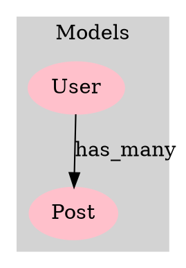

# GraphVizダイアグラム表示ガイド

GraphViz（.dot）ファイルを表示する方法を説明します。

## 📊 生成されたGraphVizファイル

1. **アプリケーション全体図**: [`doc/flow_maps/application_graph.dot`](doc/flow_maps/application_graph.dot) (3,272 bytes)
2. **ブログサンプル図**: [`doc/flow_maps/blog_app_graph.dot`](doc/flow_maps/blog_app_graph.dot) (1,788 bytes)

## 🌐 オンラインで表示（最も簡単）

### Graphviz Online（推奨）
1. [Graphviz Online](https://dreampuf.github.io/GraphvizOnline/)にアクセス
2. 左側のエディタに`.dot`ファイルの内容をペースト
3. 右側に自動的にグラフが表示されます

### WebGraphviz
1. [WebGraphviz](http://www.webgraphviz.com/)にアクセス
2. テキストエリアに`.dot`ファイルの内容をペースト
3. "Generate Graph!"ボタンをクリック

## 🖥️ ローカルで表示

### コマンドライン

**インストール（Mac）**:
```bash
brew install graphviz
```

**インストール（Ubuntu/Debian）**:
```bash
sudo apt-get install graphviz
```

**画像生成**:
```bash
# PNG形式
dot -Tpng doc/flow_maps/application_graph.dot -o graph.png

# SVG形式（拡大しても綺麗）
dot -Tsvg doc/flow_maps/application_graph.dot -o graph.svg

# PDF形式
dot -Tpdf doc/flow_maps/application_graph.dot -o graph.pdf
```

### VS Code拡張機能

1. 以下の拡張機能をインストール：
   - **Graphviz (dot) language support** - シンタックスハイライト
   - **Graphviz Preview** - プレビュー機能

2. `.dot`ファイルを開く

3. コマンドパレット（`Cmd+Shift+P`）から`Graphviz: Preview`を実行

## 📋 GraphVizの構造説明



## 🎨 生成されるグラフの特徴

### ノードの種類と色分け
- **モデル**: ピンク色のボックス
- **コントローラー**: 青色のコンポーネント形状
- **アクション**: 緑色の楕円
- **サービス**: オレンジ色の六角形
- **ルート**: 黄色のボックス

### エッジ（矢印）の意味
- **実線矢印**: 直接的な関係（has_many, belongs_to）
- **点線矢印**: 間接的な関係（has_action）
- **ラベル付き矢印**: メソッド呼び出しやアクション名

### レイアウト
- **クラスター**: 関連するノードをグループ化
- **階層構造**: ルート→コントローラー→サービス→モデル

## 💡 活用例

### 1. アーキテクチャ分析
```bash
# 複雑度の高いノードを特定
grep -c "->" doc/flow_maps/application_graph.dot | sort -nr
```

### 2. カスタムスタイル適用
```dot
// カスタムカラースキーム
node [style=filled, fillcolor=lightblue];
edge [color=gray, weight=2];
```

### 3. 部分グラフの抽出
特定のモデルに関連する部分だけを抽出して表示

## 🔧 トラブルシューティング

### エラー: "command not found: dot"
→ GraphVizがインストールされていません。上記のインストール手順を実行してください。

### 文字化け
→ UTF-8エンコーディングを確認し、フォント指定を追加：
```dot
graph [fontname="Helvetica"];
node [fontname="Helvetica"];
edge [fontname="Helvetica"];
```

### グラフが大きすぎる
→ サイズ指定を追加：
```dot
graph [size="8,10", ratio=fill];
```

---

GraphVizの詳細: https://graphviz.org/