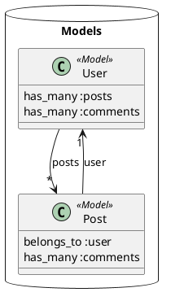

# PlantUMLダイアグラム表示ガイド

RailsFlowMapで生成されたPlantUMLダイアグラムを表示する方法をご紹介します。

## 📊 生成されたPlantUMLファイル

1. **アプリケーション全体のモデル図**: [`doc/flow_maps/application_models.puml`](doc/flow_maps/application_models.puml)
2. **ブログサンプルのモデル図**: [`doc/flow_maps/blog_app_models.puml`](doc/flow_maps/blog_app_models.puml)

## 🌐 オンラインで表示（最も簡単）

### 方法1: PlantUML Web Server

1. [PlantUML Web Server](http://www.plantuml.com/plantuml/uml/)にアクセス
2. 上記の`.puml`ファイルを開いてコンテンツをコピー
3. Web Serverのテキストエリアにペースト
4. 自動的にダイアグラムが生成されます

### 方法2: PlantText

1. [PlantText](https://www.planttext.com/)にアクセス
2. `.puml`ファイルの内容をペースト
3. "Refresh"ボタンをクリック

## 🖥️ ローカルで表示

### VS Code拡張機能（推奨）

1. VS Codeで`PlantUML`拡張機能をインストール
   ```
   拡張機能ID: jebbs.plantuml
   ```

2. `.puml`ファイルを開く

3. プレビュー表示
   - Windows/Linux: `Alt + D`
   - Mac: `Option + D`
   - またはコマンドパレット: `PlantUML: Preview Current Diagram`

### コマンドライン

**Mac (Homebrew)**:
```bash
brew install plantuml
plantuml doc/flow_maps/application_models.puml
```

**その他のOS**:
```bash
# Java必須
java -jar plantuml.jar doc/flow_maps/application_models.puml
```

## 📋 PlantUMLサンプルコンテンツ

`application_models.puml`の内容例：



## 🎨 生成される図の特徴

- **モデル間の関係**: 1対多、多対多の関連を矢印で表現
- **コントローラー構造**: APIバージョニングとアクション
- **サービス層**: ビジネスロジックとモデルアクセス
- **色分け**: モデル（ピンク）、コントローラー（青）、アクション（緑）

## 💡 活用方法

1. **アーキテクチャレビュー**: チーム全体でのシステム構造理解
2. **新メンバーオンボーディング**: 視覚的なシステム説明
3. **リファクタリング計画**: 現状把握と改善点の特定
4. **ドキュメント化**: 技術仕様書への図の組み込み

## 🔧 カスタマイズ

PlantUMLファイルを編集して、独自のスタイルや情報を追加できます：

- 色の変更: `!define MODEL_COLOR #新しい色`
- 詳細情報の追加: クラス内にメソッドやプロパティを記載
- レイアウト調整: `left to right direction`などの指定

---

PlantUMLの詳細なドキュメント: https://plantuml.com/ja/