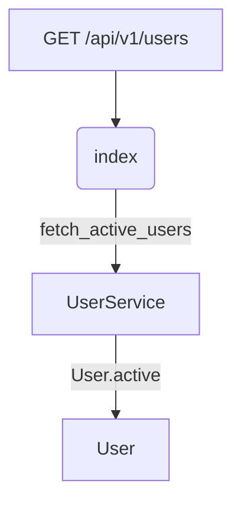

# RailsFlowMap

[](https://www.ruby-lang.org/)
[](https://rubyonrails.org/)

RailsFlowMapは、Railsアプリケーションのデータフローを可視化するgemです。モデル関係、コントローラーアクション、APIエンドポイントのフローを複数の形式で図表化し、ドキュメント作成を支援します。

## 🎯 主な機能

- **📊 複数の可視化形式**: Mermaid、PlantUML、GraphViz対応
- **🔍 エンドポイント解析**: 特定APIの内部フロー追跡
- **📖 ドキュメント対応**: GitHub/GitLabで直接表示可能
- **🏗️ アーキテクチャ理解**: モデル関係とリクエストフローの可視化
- **⚡ 簡単導入**: Rakeタスクで一発生成

## 📋 対応する可視化

### Mermaidダイアグラム


### 解析対象
- **モデル関係**: `has_many`, `belongs_to`, `has_one`等
- **ルート**: RESTful APIエンドポイント
- **コントローラー**: アクションとサービス呼び出し
- **サービス層**: ビジネスロジックとモデルアクセス

### PlantUMLダイアグラム


## 🚀 インストール

Gemfileに追加:

```ruby
gem 'rails-flow-map'
```

## 📖 使用方法

### 1. 初期設定

```bash
rails generate rails_flow_map:install
```

### 2. アプリケーション全体の解析

```bash
rake rails_flow_map:generate
```

### 3. 特定エンドポイントの解析

```bash
rake rails_flow_map:endpoint['/api/v1/users']
```

## 📁 出力ファイル

生成されたファイルは `doc/flow_maps/` に保存されます：

- `application_flow.md` - Mermaidフローダイアグラム
- `application_models.puml` - PlantUMLモデル関係図
- `application_graph.dot` - GraphViz詳細グラフ
- `endpoint_*.md` - エンドポイント固有フロー

## ⚙️ 設定

`config/initializers/rails_flow_map.rb`:

```ruby
RailsFlowMap.configure do |config|
  config.include_models = true
  config.include_controllers = true
  config.include_routes = true
  config.output_dir = 'doc/flow_maps'
  config.default_format = :mermaid
  config.model_paths = ['app/models']
  config.controller_paths = ['app/controllers']
end
```

## 📊 サンプル出力

### エンドポイントフロー (`/api/v1/users`)

```
GET /api/v1/users → UsersController#index → UserService → User model
```

### モデル関係

```
User ←→ Post ←→ Comment
  ↑      ↑
  └── Like ──┘
```

## 🛠️ 開発

### セットアップ

```bash
git clone https://github.com/yourusername/rails-flow-map.git
cd rails-flow-map
bundle install
```

### テスト実行

```bash
rspec
```

### サンプル実行

```bash
# 基本テスト
ruby simple_test.rb

# 包括的デモ
ruby comprehensive_demo.rb

# Rakeタスクシミュレーション
ruby simulate_rake_tasks.rb
```

## 🎯 使用例

**ブログAPI**のフロー解析結果：

- **6個のモデル**: User, Post, Comment, Category, Tag, Like
- **6個のルート**: CRUD操作 + 分析エンドポイント
- **4個のコントローラー**: API v1 構造
- **5個のサービス**: ビジネスロジック層

生成された図表により、リクエストがどのように内部コンポーネントを流れるかが一目で理解できます。

## 📝 ライセンス

MIT License

## 🤝 コントリビューション

1. Fork it
2. Create your feature branch (`git checkout -b my-new-feature`)
3. Commit your changes (`git commit -am 'Add some feature'`)
4. Push to the branch (`git push origin my-new-feature`)
5. Create new Pull Request

## 📞 サポート

- Issues: [GitHub Issues](https://github.com/yourusername/rails-flow-map/issues)
- Documentation: [Wiki](https://github.com/yourusername/rails-flow-map/wiki)

---

RailsFlowMapで、あなたのRailsアプリケーションのアーキテクチャを可視化し、チーム全体の理解を深めましょう！