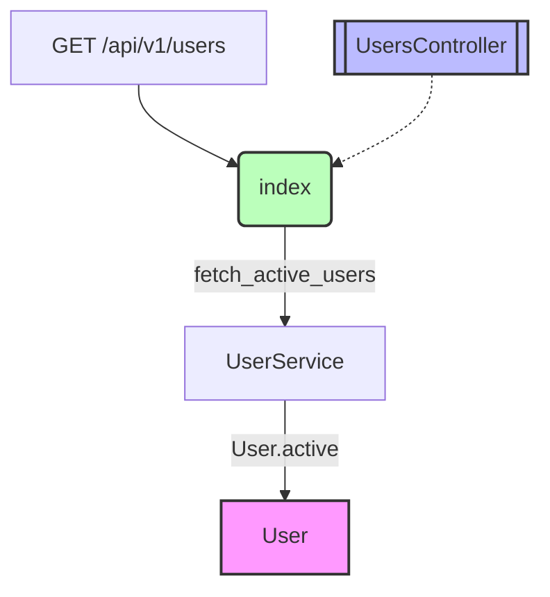
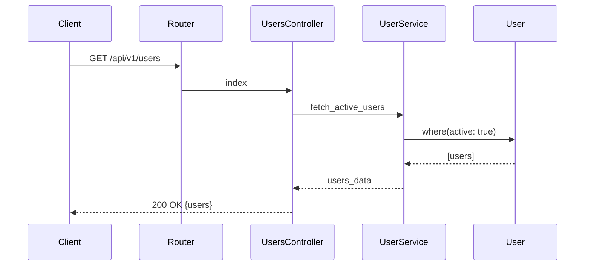

# RailsFlowMap

[](https://www.ruby-lang.org/)
[](https://rubyonrails.org/)

**English** | [日本語](README_ja.md)

RailsFlowMapは、Railsアプリケーションのデータフローを可視化する包括的な分析ツールです。コードベースの構造を自動的に解析し、様々な形式の図表を生成します。

## 📑 目次

- [主な機能](#-主な機能)
- [可視化形式と用途](#-可視化形式と用途)
  - [Mermaidダイアグラム](#1-mermaidダイアグラム)
  - [PlantUMLダイアグラム](#2-plantumlダイアグラム)
  - [GraphVizダイアグラム](#3-graphvizダイアグラム)
  - [ERD（Entity Relationship Diagram）](#4-erdentity-relationship-diagram)
  - [メトリクスレポート](#5-メトリクスレポート)
  - [インタラクティブHTML（D3.js）](#6-インタラクティブhtmld3js)
  - [OpenAPI/Swagger仕様](#7-openapiswagger仕様)
  - [シーケンス図](#8-シーケンス図)
  - [Git差分可視化](#9-git差分可視化)
  - [VS Code統合](#10-vs-code統合)
- [インストール](#-インストール)
- [使用方法](#-使用方法)
- [サンプルプロジェクト](#-サンプルプロジェクト)
- [設定](#-設定)
- [開発](#-開発)

## 🎯 主な機能

- **自動解析**: モデル、コントローラー、ルート、サービスを自動検出
- **複数形式**: 10種類の可視化形式（Mermaid、PlantUML、GraphViz、ERD、Metrics、D3.js、OpenAPI、Sequence、Git Diff、VS Code統合）
- **エンドポイント追跡**: 特定APIの内部処理フローを可視化
- **複雑度分析**: コードの複雑度と潜在的問題を検出
- **Rails統合**: Rakeタスクとジェネレーターを提供
- **インタラクティブ可視化**: D3.jsによる動的なグラフ操作
- **API文書生成**: OpenAPI/Swagger仕様の自動生成
- **アーキテクチャ進化追跡**: Git差分による構造変化の可視化

## 📊 可視化形式と用途

### 1. Mermaidダイアグラム

**用途**: アプリケーション全体のフローを理解する

Mermaidは、GitHub/GitLabで直接表示可能な図表形式です。リクエストの流れやコンポーネント間の関係を視覚的に把握できます。



**読み方**:
- 四角形: ルート、モデル、サービス
- 二重線の四角形: コントローラー
- 丸括弧: アクション
- 矢印: データや制御の流れ
- ラベル: メソッド名や関係性

**生成ファイル**: [`doc/flow_maps/application_flow.md`](doc/flow_maps/application_flow.md)

---

### 2. PlantUMLダイアグラム

**用途**: UML形式でクラス構造と関係を詳細に表現

PlantUMLは、正式なUML記法でシステム設計を文書化する際に最適です。

**表示方法**: 
- オンライン: [PlantUML Web Server](http://www.plantuml.com/plantuml/uml/)でファイル内容をペースト
- 詳細ガイド: [PlantUMLビューアガイド](PLANTUML_VIEWER.md)

**サンプル構造**:
```
┌─────────────────┐         ┌─────────────────┐
│      User       │ 1     * │      Post       │
├─────────────────┤ ───────►├─────────────────┤
│ + name: string  │         │ + title: string │
│ + email: string │         │ + body: text    │
└─────────────────┘         └─────────────────┘
```

**読み方**:
- パッケージ: 機能グループ（Models、Controllers等）
- クラスボックス: 各コンポーネント
- 関連線: 1対多、多対多などの関係
- +/-: publicメソッド/privateメソッド

**生成ファイル**: 
- [`doc/flow_maps/application_models.puml`](doc/flow_maps/application_models.puml)
- [`doc/flow_maps/blog_app_models.puml`](doc/flow_maps/blog_app_models.puml)

---

### 3. GraphVizダイアグラム

**用途**: 大規模で複雑なシステムの詳細な依存関係を分析

GraphVizは、自動レイアウト機能により、数百のノードがある複雑なシステムでも見やすく配置します。

**表示方法**: 
- オンライン: [Graphviz Online](https://dreampuf.github.io/GraphvizOnline/)でファイル内容をペースト
- 詳細ガイド: [GraphVizビューアガイド](GRAPHVIZ_VIEWER.md)

**特徴**:
- 階層的レイアウト（上から下、左から右）
- クラスター機能でグループ化
- 豊富なスタイル設定（色、形、線種）

**読み方**:
- subgraph: 機能単位のグループ
- ノード形状: box（通常）、component（コントローラー）、ellipse（アクション）
- エッジスタイル: 実線（直接関係）、点線（間接関係）

**生成ファイル**: 
- [`doc/flow_maps/application_graph.dot`](doc/flow_maps/application_graph.dot)
- [`doc/flow_maps/blog_app_graph.dot`](doc/flow_maps/blog_app_graph.dot)

---

### 4. ERD（Entity Relationship Diagram）

**用途**: データベーススキーマとテーブル間の関係を理解

ERDは、データベース設計の確認や、モデル間の関連を一目で把握するのに適しています。

```
┌─────────────────────┐
│        User         │
├─────────────────────┤
│ id         :integer │
│ name       :string  │
│ email      :string  │
│ created_at :datetime│
└─────────────────────┘
          ║
          ║ has_many
          ▼
┌─────────────────────┐
│        Post         │
├─────────────────────┤
│ id         :integer │
│ user_id    :integer │
│ title      :string  │
│ body       :text    │
└─────────────────────┘
```

**読み方**:
- ボックス: テーブル
- 上段: テーブル名
- 下段: カラムと型
- 矢印: 外部キー関係

**生成ファイル**: [`doc/flow_maps/sample_erd.txt`](doc/flow_maps/sample_erd.txt)

---

### 5. メトリクスレポート

**用途**: コード品質の分析と改善点の特定

メトリクスレポートは、技術的負債の管理とリファクタリング計画に役立ちます。

**サンプル出力**:
```markdown
## 📊 Rails Application Metrics Report

### 🏆 Complexity Analysis
1. User (connections: 15) ⚠️ High complexity
2. Post (connections: 8)
3. Comment (connections: 6)

### ⚠️ Potential Issues
- Circular Dependencies: User ↔ Post
- God Objects: User model has 15+ connections

### 💡 Recommendations
- Consider extracting UserProfile from User model
- Implement service layer for complex operations
```

**含まれる分析**:
- 複雑度スコア（接続数ベース）
- 循環依存の検出
- Godオブジェクトの特定
- 具体的な改善提案

**生成ファイル**: [`doc/flow_maps/metrics_report.md`](doc/flow_maps/metrics_report.md)

---

### 6. インタラクティブHTML（D3.js）

**用途**: ブラウザで動的に操作可能な可視化

D3.jsを使用したインタラクティブなグラフで、ズーム、ドラッグ、検索、フィルタリングが可能です。

**機能**:
- ノードをドラッグして配置変更
- ダブルクリックで関連ノードをハイライト
- 検索ボックスでコンポーネントを探す
- タイプ別フィルタリング
- ズーム・パン操作

**生成コマンド**:
```bash
rake rails_flow_map:export FORMAT=d3js OUTPUT=doc/interactive.html
open doc/interactive.html
```

**生成ファイル**: `doc/flow_maps/interactive.html`

---

### 7. OpenAPI/Swagger仕様

**用途**: API仕様書の自動生成

Rails のルート情報から OpenAPI 3.0 仕様を自動生成します。

**出力例**:
```yaml
openapi: 3.0.0
info:
  title: Rails API Documentation
  version: 1.0.0
paths:
  /api/v1/users:
    get:
      summary: List all users
      responses:
        '200':
          description: Successful response
```

**用途**:
- API ドキュメントの自動化
- Postman/Insomnia へのインポート
- フロントエンドチームとの仕様共有

**生成ファイル**: `doc/flow_maps/openapi_spec.yaml`

---

### 8. シーケンス図

**用途**: リクエスト処理の時系列フローを可視化

エンドポイントごとに、リクエストがどのようにシステム内を流れるかを時系列で表示します。



**オプション**:
- ミドルウェア処理の表示
- コールバックの表示
- バリデーション処理の表示
- データベースアクセスの詳細

**生成ファイル**: `doc/flow_maps/sequence_*.md`

---

### 9. Git差分可視化

**用途**: コミット間のアーキテクチャ変化を視覚化

2つのグラフ状態を比較し、追加・削除・変更されたノードとエッジを表示します。

**機能**:
- ノードの追加/削除/変更検出
- 複雑度メトリクスの変化計算
- 破壊的変更の検出
- 改善推奨事項の生成

**使用例**:
```ruby
before_graph = RailsFlowMap.analyze_at('main')
after_graph = RailsFlowMap.analyze_at('feature/new-api')
diff = RailsFlowMap.diff(before_graph, after_graph)
```

**生成ファイル**: `doc/flow_maps/architecture_diff.md`

---

### 10. VS Code統合

**用途**: エディタ内でリアルタイム可視化

VS Code 拡張機能や設定により、コーディング中にアーキテクチャを確認できます。

**統合方法**:
- VS Code タスク設定
- カスタムスニペット
- ワークスペース設定
- キーボードショートカット

詳細は [VS Code統合ガイド](doc/vscode_integration.md) を参照してください。

## 🚀 インストール

### Gemfileに追加

```ruby
gem 'rails-flow-map'
```

### インストール実行

```bash
bundle install
```

## 📖 使用方法

### 1. 初期設定

```bash
rails generate rails_flow_map:install
```

### 2. 基本的な使用

#### 全体解析
```bash
# アプリケーション全体を解析
rake rails_flow_map:generate
```

#### エンドポイント固有の解析
```bash
# 特定のAPIエンドポイントを解析
rake rails_flow_map:endpoint['/api/v1/users']
```

#### 特定形式での出力
```bash
# ERD形式で出力
rake rails_flow_map:generate[erd]

# メトリクスレポート生成
rake rails_flow_map:generate[metrics]
```

### 3. Ruby コードでの使用

```ruby
# グラフの生成
graph = RailsFlowMap.analyze

# 各形式でエクスポート
RailsFlowMap.export(graph, format: :mermaid, output: 'flow.md')
RailsFlowMap.export(graph, format: :plantuml, output: 'models.puml')
RailsFlowMap.export(graph, format: :graphviz, output: 'graph.dot')
RailsFlowMap.export(graph, format: :erd, output: 'schema.txt')
RailsFlowMap.export(graph, format: :metrics, output: 'metrics.md')
RailsFlowMap.export(graph, format: :d3js, output: 'interactive.html')
RailsFlowMap.export(graph, format: :openapi, output: 'api_spec.yaml')
RailsFlowMap.export(graph, format: :sequence, output: 'sequence.md', endpoint: '/api/v1/users')

# Git差分解析
before_graph = RailsFlowMap.analyze_at('main')
after_graph = RailsFlowMap.analyze
diff_result = RailsFlowMap.diff(before_graph, after_graph, format: :mermaid)
```

## 📁 出力ファイル

すべての図表は `doc/flow_maps/` ディレクトリに生成されます：

| ファイル | 形式 | 用途 |
|---------|------|------|
| `application_flow.md` | Mermaid | 全体フロー図 |
| `application_models.puml` | PlantUML | UMLクラス図 |
| `application_graph.dot` | GraphViz | 詳細依存グラフ |
| `sample_erd.txt` | ERD | DBスキーマ |
| `metrics_report.md` | Metrics | 品質分析レポート |
| `interactive.html` | D3.js | インタラクティブ可視化 |
| `openapi_spec.yaml` | OpenAPI | API仕様書 |
| `sequence_*.md` | Sequence | シーケンス図 |
| `architecture_diff.md` | Git Diff | 変更差分可視化 |

## 🎪 サンプルプロジェクト

[`blog_sample/`](blog_sample/) ディレクトリに、完全なブログAPIのサンプルが含まれています：

- 9つのモデル（User、Post、Comment等）
- RESTful APIコントローラー
- サービス層アーキテクチャ
- 実行可能なデモスクリプト

詳細は [blog_sample/README.md](blog_sample/README.md) を参照してください。

## ⚙️ 設定

`config/initializers/rails_flow_map.rb`:

```ruby
RailsFlowMap.configure do |config|
  # 解析対象の設定
  config.include_models = true
  config.include_controllers = true
  config.include_routes = true
  config.include_services = true
  
  # 出力設定
  config.output_dir = 'doc/flow_maps'
  config.default_format = :mermaid
  
  # パス設定
  config.model_paths = ['app/models']
  config.controller_paths = ['app/controllers']
  config.service_paths = ['app/services']
  
  # 除外設定
  config.exclude_patterns = ['test_', 'spec_']
end
```

## 🛠️ 開発

### セットアップ

```bash
git clone https://github.com/0809android/rails-flow-map.git
cd rails-flow-map
bundle install
```

### テスト実行

```bash
# 単体テスト
rspec

# 統合テスト
ruby test_basic_functionality.rb

# 新フォーマットのデモ
ruby demo_new_formats.rb
```

### 今後の拡張予定

以下の機能が実装済みです：

- ✅ Interactive HTML (D3.js) - インタラクティブなグラフ操作
- ✅ API Blueprint/OpenAPI - API仕様の自動生成
- ✅ Sequence Diagrams - リクエストフローの時系列表示
- ✅ Git Diff Visualization - アーキテクチャ変更の可視化
- ✅ VS Code Integration - エディタ統合ガイド

詳細は [FUTURE_FORMATS.md](FUTURE_FORMATS.md) を参照してください。

## 📝 ライセンス

MIT License

## 🤝 コントリビューション

1. Fork it
2. Create your feature branch (`git checkout -b my-new-feature`)
3. Commit your changes (`git commit -am 'Add some feature'`)
4. Push to the branch (`git push origin my-new-feature`)
5. Create new Pull Request

## 📞 サポート

- Issues: [GitHub Issues](https://github.com/0809android/rails-flow-map/issues)
- Documentation: [Wiki](https://github.com/0809android/rails-flow-map/wiki)

---

RailsFlowMapで、あなたのRailsアプリケーションのアーキテクチャを可視化し、より良い設計判断を！