```mermaid
graph TD
    route_users[GET /api/v1/users]
    controller_users[[UsersController]]
    action_users_index(index)
    service_user[UserService]
    model_user[User]

    route_users --> action_users_index
    controller_users -.-> action_users_index
    action_users_index -->|fetch_active_users| service_user
    service_user -->|User.active| model_user

    %% スタイリング
    classDef model fill:#f9f,stroke:#333,stroke-width:2px;
    classDef controller fill:#bbf,stroke:#333,stroke-width:2px;
    classDef action fill:#bfb,stroke:#333,stroke-width:2px;
    class model_user model;
    class controller_users controller;
    class action_users_index action;
```

# RailsFlowMap

[](https://www.ruby-lang.org/)
[](https://rubyonrails.org/)

RailsFlowMapは、Railsアプリケーションのデータフローを可視化する包括的な分析ツールです。コードベースの構造を自動的に解析し、様々な形式の図表を生成します。

[English](README.md) | **日本語**

## 📑 目次

- [主な機能](#-主な機能)
- [可視化形式と用途](#-可視化形式と用途)
  - [Mermaidダイアグラム](#1-mermaidダイアグラム)
  - [PlantUMLダイアグラム](#2-plantumlダイアグラム)
  - [GraphVizダイアグラム](#3-graphvizダイアグラム)
  - [ERD（エンティティ関係図）](#4-erdエンティティ関係図)
  - [メトリクスレポート](#5-メトリクスレポート)
- [インストール](#-インストール)
- [使用方法](#-使用方法)
- [サンプルプロジェクト](#-サンプルプロジェクト)
- [設定](#️-設定)
- [開発](#️-開発)

## 🎯 主な機能

- **自動解析**: モデル、コントローラー、ルート、サービスを自動検出
- **複数形式**: 5種類の可視化形式（Mermaid、PlantUML、GraphViz、ERD、Metrics）
- **エンドポイント追跡**: 特定APIの内部処理フローを可視化
- **複雑度分析**: コードの複雑度と潜在的問題を検出
- **Rails統合**: Rakeタスクとジェネレーターを提供

## 📊 可視化形式と用途

### 1. Mermaidダイアグラム

**こんな時に使う**: アプリケーション全体のフローを素早く理解したい

Mermaidは、GitHub/GitLabで直接表示可能な図表形式です。リクエストの流れやコンポーネント間の関係を視覚的に把握できます。



**図の読み方**:
- 🟦 四角形: ルート、モデル、サービス
- 🟦🟦 二重線の四角形: コントローラー
- 🟢 丸括弧: アクション
- ➡️ 矢印: データや制御の流れ
- 📝 ラベル: メソッド名や関係性

**生成ファイル**: [`doc/flow_maps/application_flow.md`](doc/flow_maps/application_flow.md)

**メリット**:
- GitHubで自動的に図として表示される
- マークダウンに直接埋め込める
- 編集が簡単

---

### 2. PlantUMLダイアグラム

**こんな時に使う**: 正式な設計書を作成したい、UML記法で文書化したい

PlantUMLは、正式なUML記法でシステム設計を文書化する際に最適です。

**表示方法**: 
- 🌐 オンライン: [PlantUML Web Server](http://www.plantuml.com/plantuml/uml/)でファイル内容をペースト
- 📖 詳細ガイド: [PlantUMLビューアガイド](PLANTUML_VIEWER.md)

**サンプル構造**:
```
┌─────────────────┐         ┌─────────────────┐
│      User       │ 1     * │      Post       │
├─────────────────┤ ───────►├─────────────────┤
│ + name: string  │         │ + title: string │
│ + email: string │         │ + body: text    │
│ - password: str │         │ + published: bool│
└─────────────────┘         └─────────────────┘
        △                            △
        │                            │
        └────────────┬───────────────┘
                     │
              ┌─────────────────┐
              │    Comment      │
              ├─────────────────┤
              │ + body: text    │
              │ + created_at    │
              └─────────────────┘
```

**図の読み方**:
- 📦 パッケージ: 機能グループ（Models、Controllers等）
- 📋 クラスボックス: 各コンポーネント
- ➡️ 関連線: 1対多、多対多などの関係
- ➕➖ +/-: publicメソッド/privateメソッド

**生成ファイル**: 
- [`doc/flow_maps/application_models.puml`](doc/flow_maps/application_models.puml)
- [`doc/flow_maps/blog_app_models.puml`](doc/flow_maps/blog_app_models.puml)

**メリット**:
- 正式なUML記法
- 詳細な属性やメソッドを記載可能
- エンタープライズ向けドキュメントに最適

---

### 3. GraphVizダイアグラム

**こんな時に使う**: 大規模システムの依存関係を詳細に分析したい

GraphVizは、自動レイアウト機能により、数百のノードがある複雑なシステムでも見やすく配置します。

**表示方法**: 
- 🌐 オンライン: [Graphviz Online](https://dreampuf.github.io/GraphvizOnline/)でファイル内容をペースト
- 📖 詳細ガイド: [GraphVizビューアガイド](GRAPHVIZ_VIEWER.md)

**特徴**:
- 🏗️ 階層的レイアウト（上から下、左から右）
- 📁 クラスター機能でグループ化
- 🎨 豊富なスタイル設定（色、形、線種）

**図の読み方**:
- 📂 subgraph: 機能単位のグループ
- 🔲 ノード形状: box（通常）、component（コントローラー）、ellipse（アクション）
- 〰️ エッジスタイル: 実線（直接関係）、点線（間接関係）

**生成ファイル**: 
- [`doc/flow_maps/application_graph.dot`](doc/flow_maps/application_graph.dot)
- [`doc/flow_maps/blog_app_graph.dot`](doc/flow_maps/blog_app_graph.dot)

**メリット**:
- 複雑なシステムでも自動的に最適配置
- 循環依存の発見が容易
- 大規模プロジェクトに最適

---

### 4. ERD（エンティティ関係図）

**こんな時に使う**: データベース設計を確認したい、テーブル構造を把握したい

ERDは、データベース設計の確認や、モデル間の関連を一目で把握するのに適しています。

```
┌─────────────────────┐
│        User         │
├─────────────────────┤
│ id         :integer │ 🔑 主キー
│ name       :string  │
│ email      :string  │ 📧 ユニーク
│ created_at :datetime│
└─────────────────────┘
          ║
          ║ has_many
          ▼
┌─────────────────────┐
│        Post         │
├─────────────────────┤
│ id         :integer │ 🔑
│ user_id    :integer │ 🔗 外部キー
│ title      :string  │
│ body       :text    │
│ published  :boolean │
└─────────────────────┘
```

**図の読み方**:
- 📊 ボックス: テーブル
- 🏷️ 上段: テーブル名
- 📝 下段: カラムと型
- ⬇️ 矢印: 外部キー関係
- 🔑 主キー、🔗 外部キー

**生成ファイル**: [`doc/flow_maps/sample_erd.txt`](doc/flow_maps/sample_erd.txt)

**メリット**:
- データベース構造が一目瞭然
- 正規化の確認が容易
- マイグレーション計画に有用

---

### 5. メトリクスレポート

**こんな時に使う**: コード品質を分析したい、リファクタリング対象を特定したい

メトリクスレポートは、技術的負債の管理とリファクタリング計画に役立ちます。

**サンプル出力**:
```markdown
## 📊 Rails Application Metrics Report

### 🏆 複雑度分析
1. User (接続数: 15) ⚠️ 高複雑度
2. Post (接続数: 8)
3. Comment (接続数: 6)

### ⚠️ 潜在的な問題
- 循環依存: User ↔ Post
- Godオブジェクト: Userモデルが15以上の接続

### 💡 改善提案
- UserモデルからUserProfileを分離することを検討
- 複雑な操作にはサービス層を実装
- PostとUserの循環依存を解消
```

**含まれる分析**:
- 📊 複雑度スコア（接続数ベース）
- 🔄 循環依存の検出
- 👁️ Godオブジェクトの特定
- 💡 具体的な改善提案

**生成ファイル**: [`doc/flow_maps/metrics_report.md`](doc/flow_maps/metrics_report.md)

**メリット**:
- 客観的な品質指標
- 優先順位付けが可能
- 進捗の追跡が容易

## 🚀 インストール

### Gemfileに追加

```ruby
gem 'rails-flow-map'
```

### インストール実行

```bash
bundle install
```

## 📖 使用方法

### 1. 初期設定

```bash
rails generate rails_flow_map:install
```

これにより `config/initializers/rails_flow_map.rb` が作成されます。

### 2. 基本的な使用

#### 全体解析（推奨）
```bash
# すべての形式で出力
rake rails_flow_map:generate

# 特定の形式で出力
rake rails_flow_map:generate[mermaid]
rake rails_flow_map:generate[plantuml]
rake rails_flow_map:generate[graphviz]
rake rails_flow_map:generate[erd]
rake rails_flow_map:generate[metrics]
```

#### エンドポイント固有の解析
```bash
# 特定のAPIエンドポイントを解析
rake rails_flow_map:endpoint['/api/v1/users']

# エンドポイントを特定形式で
rake rails_flow_map:endpoint['/api/v1/users',mermaid]
```

### 3. Ruby コードでの使用

```ruby
# グラフの生成
graph = RailsFlowMap.analyze

# 特定の解析のみ
graph = RailsFlowMap.analyze(
  models: true,
  controllers: true,
  routes: false,
  services: true
)

# 各形式でエクスポート
RailsFlowMap.export(graph, format: :mermaid, output: 'flow.md')
RailsFlowMap.export(graph, format: :plantuml, output: 'models.puml')
RailsFlowMap.export(graph, format: :graphviz, output: 'graph.dot')
RailsFlowMap.export(graph, format: :erd, output: 'schema.txt')
RailsFlowMap.export(graph, format: :metrics, output: 'metrics.md')

# エンドポイント固有の解析
endpoint_graph = RailsFlowMap.analyze_endpoint('/api/v1/users')
RailsFlowMap.export(endpoint_graph, format: :sequence)
```

## 📁 出力ファイル

すべての図表は `doc/flow_maps/` ディレクトリに生成されます：

| ファイル | 形式 | 用途 | いつ使う |
|---------|------|------|----------|
| `application_flow.md` | Mermaid | 全体フロー図 | README作成、チーム共有 |
| `application_models.puml` | PlantUML | UMLクラス図 | 設計書、仕様書 |
| `application_graph.dot` | GraphViz | 詳細依存グラフ | 依存関係分析 |
| `sample_erd.txt` | ERD | DBスキーマ | DB設計確認 |
| `metrics_report.md` | Metrics | 品質分析レポート | リファクタリング計画 |

## 🎪 サンプルプロジェクト

[`blog_sample/`](blog_sample/) ディレクトリに、完全なブログAPIのサンプルが含まれています：

- 📊 9つのモデル（User、Post、Comment、Category、Tag、Like、Profile、UserFollowing）
- 🌐 RESTful APIコントローラー（CRUD操作完備）
- 🛠️ サービス層アーキテクチャ（ビジネスロジックの分離）
- 🚀 実行可能なデモスクリプト

詳細は [blog_sample/README.md](blog_sample/README.md) を参照してください。

## ⚙️ 設定

`config/initializers/rails_flow_map.rb`:

```ruby
RailsFlowMap.configure do |config|
  # 解析対象の設定
  config.include_models = true        # モデルを解析
  config.include_controllers = true   # コントローラーを解析
  config.include_routes = true        # ルートを解析
  config.include_services = true      # サービスクラスを解析
  
  # 出力設定
  config.output_dir = 'doc/flow_maps'
  config.default_format = :mermaid
  
  # パス設定
  config.model_paths = ['app/models']
  config.controller_paths = ['app/controllers']
  config.service_paths = ['app/services', 'app/use_cases']
  
  # 除外設定
  config.exclude_patterns = ['test_', 'spec_', 'tmp_']
  
  # 詳細設定
  config.include_attributes = false   # モデル属性を含める
  config.include_methods = false      # メソッドを含める
  config.max_depth = 5               # 解析の最大深度
end
```

## 🛠️ 開発

### セットアップ

```bash
git clone https://github.com/0809android/rails-flow-map.git
cd rails-flow-map
bundle install
```

### テスト実行

```bash
# 単体テスト
rspec

# 統合テスト
ruby test_basic_functionality.rb

# 新フォーマットのデモ
ruby demo_new_formats.rb

# サンプルプロジェクトのテスト
cd blog_sample/blog_sample
ruby test_rails_flow_map.rb
```

### 今後の拡張予定

[FUTURE_FORMATS.md](FUTURE_FORMATS.md) に、以下の追加予定機能が記載されています：

- 🌐 Interactive HTML (D3.js) - ブラウザで操作可能
- 📄 API Blueprint/OpenAPI - API仕様書生成
- 📊 Sequence Diagrams - より詳細なシーケンス図
- 🔄 Git Diff Visualization - 変更の可視化
- 💻 VS Code Integration - エディタ統合

## 📝 ライセンス

MIT License

## 🤝 コントリビューション

1. Fork it
2. Create your feature branch (`git checkout -b my-new-feature`)
3. Commit your changes (`git commit -am 'Add some feature'`)
4. Push to the branch (`git push origin my-new-feature`)
5. Create new Pull Request

### コントリビューション歓迎

- 🐛 バグ報告
- 💡 新機能の提案
- 📖 ドキュメントの改善
- 🌏 翻訳

## 📞 サポート

- Issues: [GitHub Issues](https://github.com/0809android/rails-flow-map/issues)
- Documentation: [Wiki](https://github.com/0809android/rails-flow-map/wiki)

---

RailsFlowMapで、あなたのRailsアプリケーションのアーキテクチャを可視化し、より良い設計判断を！