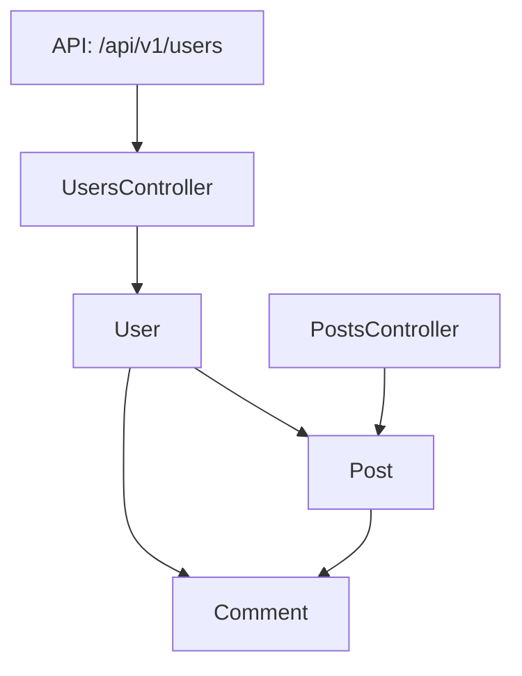

# Rails Flow Map 🚀

[](https://github.com/railsflowmap/rails-flow-map)
[](LICENSE)
[](https://www.ruby-lang.org/)
[](https://rubyonrails.org/)

> 🎯 **包括的なRailsアプリケーションアーキテクチャ可視化ツール**

Rails Flow MapはRailsアプリケーションの構造を解析し、アーキテクチャ、依存関係、データフローパターンの理解を助ける美しいインタラクティブな可視化を生成する強力なgemです。

**[English](README.md) | [中文](README_zh.md)**

---

## ✨ 機能

### 🎨 複数の可視化フォーマット
- **🌊 Mermaid図** - GitHub対応のMarkdown図
- **🏗️ PlantUML** - 詳細なUMLクラス図  
- **🔗 GraphViz** - ネットワーク型関係図
- **⚡ インタラクティブD3.js** - ズーム・ドラッグ可能なWeb可視化
- **📊 メトリクスレポート** - コード品質・複雑性解析
- **🔄 シーケンス図** - APIエンドポイントフロー可視化
- **📋 OpenAPI仕様** - 自動生成API文書
- **📈 ERD図** - データベーススキーマ可視化
- **🔍 Git差分表示** - アーキテクチャ変更比較

### 🛡️ エンタープライズレベルのセキュリティ
- **パストラバーサル保護** - 悪意のあるファイルアクセスを防止
- **XSS防止** - 全HTMLアウトプットのサニタイズ
- **入力検証** - 包括的なパラメータチェック
- **セキュリティイベントログ** - 潜在的脅威のトラッキング

### ⚡ パフォーマンス・信頼性
- **構造化ログ** - パフォーマンスメトリクスとデバッグ情報
- **エラーハンドリング** - コンテキスト付き堅牢な例外管理
- **リトライロジック** - 一時的な障害からの自動復旧
- **メモリ最適化** - 大規模アプリケーション向け効率的処理

### 🔧 開発者体験
- **ゼロ設定** - すぐに使える
- **柔軟な統合** - Rakeタスク、Ruby API、CI/CDサポート
- **包括的ドキュメント** - 例とベストプラクティス
- **VS Code統合** - 組み込みタスク定義

---

## 🚀 クイックスタート

### インストール

Gemfileに追加:

```ruby
gem 'rails-flow-map'
```

```bash
bundle install
rails generate rails_flow_map:install
```

### 基本的な使用方法

```ruby
# アーキテクチャ概要を生成
graph = RailsFlowMap.analyze
RailsFlowMap.export(graph, format: :mermaid, output: 'docs/architecture.md')

# インタラクティブ可視化を作成
RailsFlowMap.export(graph, format: :d3js, output: 'public/architecture.html')

# API文書を生成
RailsFlowMap.export(graph, format: :openapi, output: 'docs/api.yaml')
```

### Rakeタスクの使用

```bash
# 全ての可視化を生成
rake flow_map:generate

# 特定のフォーマット
rake flow_map:generate FORMAT=mermaid OUTPUT=docs/flow.md

# APIエンドポイント解析
rake flow_map:endpoint ENDPOINT=/api/v1/users FORMAT=sequence
```

---

## 📊 可視化例

### 🌊 Mermaidアーキテクチャ図



### ⚡ インタラクティブD3.js可視化

*機能: ズーム、ドラッグ、コンポーネントタイプ別フィルタ、検索機能*

### 📋 OpenAPI文書

```yaml
openapi: 3.0.0
info:
  title: Rails API Documentation
  version: 1.0.0
paths:
  /api/v1/users:
    get:
      summary: 全ユーザーを取得
      responses:
        200:
          description: 成功レスポンス
```

---

## 🎯 使用例

### 👥 開発チーム向け

- **📚 文書化** - 常に最新のアーキテクチャ文書を自動生成
- **🔍 コードレビュー** - PRでアーキテクチャ変更を可視化
- **🎓 オンボーディング** - 新メンバーがコードベースを理解する支援
- **🏗️ リファクタリング** - 変更前に依存関係を特定

### 🚀 DevOps・CI/CD向け

- **📊 モニタリング** - アーキテクチャ複雑性の経時変化を追跡
- **🔄 自動化** - デプロイ時に文書を自動生成
- **📈 メトリクス** - コード品質と依存関係メトリクスを収集
- **🚨 アラート** - 破壊的なアーキテクチャ変更を検出

### 📋 APIチーム向け

- **📖 API文書** - OpenAPI仕様書を自動生成
- **🔄 フロー図** - リクエスト/レスポンスフローを可視化
- **🧪 テスト** - エンドポイント依存関係を理解
- **📚 クライアントSDK** - 明確なAPI構造文書を提供

---

## 🔧 設定

### 基本設定

```ruby
# config/initializers/rails_flow_map.rb
RailsFlowMap.configure do |config|
  config.output_directory = 'doc/flow_maps'
  config.exclude_paths = ['vendor/', 'tmp/']
  config.default_format = :mermaid
end
```

### 高度な設定

```ruby
RailsFlowMap.configure do |config|
  # 解析オプション
  config.include_models = true
  config.include_controllers = true
  config.include_routes = true
  
  # パフォーマンスオプション
  config.streaming_mode = true
  config.memory_limit = 512.megabytes
  
  # セキュリティオプション
  config.sanitize_output = true
  config.allow_system_paths = false
end
```

---

## 📚 ドキュメント

### クイックリファレンス
- 📖 [**使用例**](USAGE_EXAMPLES_ja.md) - 包括的な使用ガイド
- ⚡ [**クイックリファレンス**](QUICK_REFERENCE.md) - 一般的なコマンドとパターン
- 🔧 [**APIドキュメント**](https://rubydoc.info/github/railsflowmap/rails-flow-map) - YARD文書

### 統合ガイド
- 🔄 [**CI/CD統合**](docs/ci_cd_integration.md) - GitHub Actions、GitLab CI
- 💻 [**VS Code統合**](doc/vscode_integration.md) - エディタ設定とタスク
- 🐳 [**Docker統合**](docs/docker_integration.md) - コンテナ化ワークフロー

### 例
- 🚀 [**基本例**](examples/basic_usage.rb) - 入門コードサンプル
- 🔬 [**高度なパターン**](examples/advanced_patterns.rb) - 複雑な使用例

---

## 🛠️ サポートされるフォーマット

| フォーマット | 説明 | 適用場面 | 出力 |
|--------|-------------|----------|---------|
| `mermaid` | GitHub対応図 | 文書、README | `.md` |
| `plantuml` | 詳細UML図 | 技術文書 | `.puml` |
| `d3js` | インタラクティブ可視化 | 探索、プレゼン | `.html` |
| `openapi` | API仕様書 | API文書 | `.yaml` |
| `sequence` | リクエストフロー図 | API解析 | `.md` |
| `erd` | データベーススキーマ | データモデリング | `.md` |
| `metrics` | コード品質レポート | コードレビュー、監視 | `.md` |
| `graphviz` | ネットワーク図 | 複雑な関係 | `.dot` |

---

## 🔗 統合

### GitHub Actions

```yaml
name: アーキテクチャ文書生成
on: [push]
jobs:
  docs:
    runs-on: ubuntu-latest
    steps:
      - uses: actions/checkout@v3
      - uses: ruby/setup-ruby@v1
      - run: bundle exec rake flow_map:generate_all
```

### VS Codeタスク

```json
{
  "label": "アーキテクチャ文書生成",
  "type": "shell",
  "command": "bundle exec rake flow_map:generate_all"
}
```

### Pre-commitフック

```bash
#!/bin/bash
bundle exec rake flow_map:diff > ARCHITECTURE_CHANGES.md
git add ARCHITECTURE_CHANGES.md
```

---

## 🤝 貢献

貢献を歓迎します！詳細は[貢献ガイド](CONTRIBUTING.md)をご覧ください。

### 開発環境設定

```bash
git clone https://github.com/railsflowmap/rails-flow-map.git
cd rails-flow-map
bundle install
rake spec
```

### テスト実行

```bash
# 全テスト実行
bundle exec rspec

# 特定テスト実行
bundle exec rspec spec/rails_flow_map/formatters/mermaid_formatter_spec.rb

# カバレッジ付き実行
COVERAGE=true bundle exec rspec
```

---

## 📄 ライセンス

Rails Flow Mapは[MITライセンス](LICENSE)でリリースされています。

---

## 🙏 謝辞

- 全ての[貢献者](https://github.com/railsflowmap/rails-flow-map/contributors)に感謝
- より良いアーキテクチャ可視化を求めるRailsコミュニティにインスパイア
- Railsエコシステムへの❤️で構築

---

## 🔗 リンク

- 📖 [ドキュメント](https://docs.railsflowmap.org)
- 🐛 [バグレポート](https://github.com/railsflowmap/rails-flow-map/issues)
- 💬 [ディスカッション](https://github.com/railsflowmap/rails-flow-map/discussions)
- 🐦 [Twitter](https://twitter.com/railsflowmap)

---

<div align="center">

**⭐ Rails Flow Mapがチームの役に立ったらGitHubでスターを！ ⭐**

[⬆ トップに戻る](#rails-flow-map-)

</div>