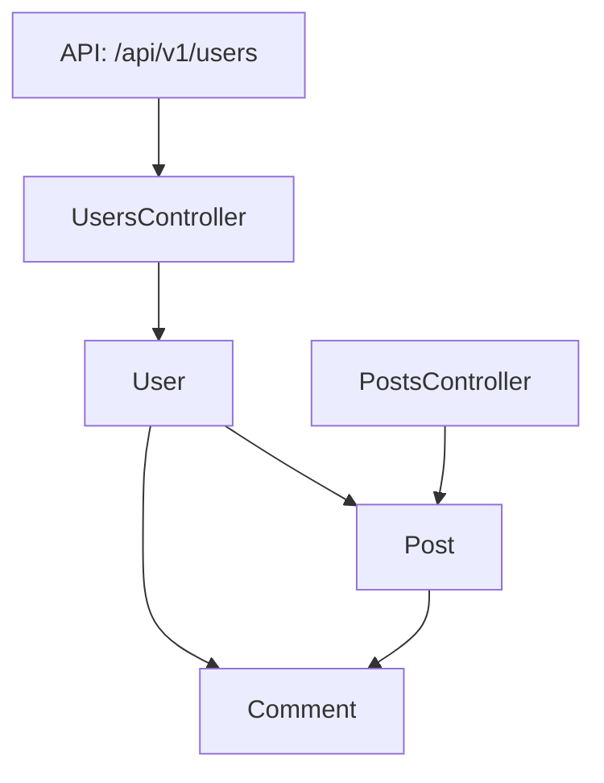

# Rails Flow Map 🚀

[](https://github.com/railsflowmap/rails-flow-map)
[](LICENSE)
[](https://www.ruby-lang.org/)
[](https://rubyonrails.org/)

> 🎯 **全面的Rails应用架构可视化工具**

Rails Flow Map是一个强大的gem，它分析您的Rails应用程序结构并生成精美的交互式可视化，帮助理解架构、依赖关系和数据流模式。

**[English](README.md) | [日本語](README_ja.md)**

---

## ✨ 功能特性

### 🎨 多种可视化格式
- **🌊 Mermaid图表** - GitHub友好的Markdown图表
- **🏗️ PlantUML** - 详细的UML类图  
- **🔗 GraphViz** - 网络式关系图
- **⚡ 交互式D3.js** - 可缩放、可拖拽的Web可视化
- **📊 指标报告** - 代码质量和复杂性分析
- **🔄 序列图** - API端点流程可视化
- **📋 OpenAPI规范** - 自动生成API文档
- **📈 ERD图表** - 数据库模式可视化
- **🔍 Git差异视图** - 架构变更对比

### 🛡️ 企业级安全
- **路径遍历保护** - 防止恶意文件访问
- **XSS防护** - 清理所有HTML输出
- **输入验证** - 全面的参数检查
- **安全事件日志** - 跟踪潜在威胁

### ⚡ 性能与可靠性
- **结构化日志** - 性能指标和调试信息
- **错误处理** - 带上下文的强健异常管理
- **重试逻辑** - 从暂时性故障自动恢复
- **内存优化** - 大型应用的高效处理

### 🔧 开发者体验
- **零配置** - 开箱即用
- **灵活集成** - Rake任务、Ruby API、CI/CD支持
- **全面文档** - 示例和最佳实践
- **VS Code集成** - 内置任务定义

---

## 🚀 快速开始

### 安装

添加到Gemfile:

```ruby
gem 'rails-flow-map'
```

```bash
bundle install
rails generate rails_flow_map:install
```

### 基本用法

```ruby
# 生成架构概览
graph = RailsFlowMap.analyze
RailsFlowMap.export(graph, format: :mermaid, output: 'docs/architecture.md')

# 创建交互式可视化
RailsFlowMap.export(graph, format: :d3js, output: 'public/architecture.html')

# 生成API文档
RailsFlowMap.export(graph, format: :openapi, output: 'docs/api.yaml')
```

### 使用Rake任务

```bash
# 生成所有可视化
rake flow_map:generate

# 特定格式
rake flow_map:generate FORMAT=mermaid OUTPUT=docs/flow.md

# 分析API端点
rake flow_map:endpoint ENDPOINT=/api/v1/users FORMAT=sequence
```

---

## 📊 可视化示例

### 🌊 Mermaid架构图



### ⚡ 交互式D3.js可视化

*功能：缩放、拖拽、按组件类型过滤、搜索功能*

### 📋 OpenAPI文档

```yaml
openapi: 3.0.0
info:
  title: Rails API Documentation
  version: 1.0.0
paths:
  /api/v1/users:
    get:
      summary: 获取所有用户
      responses:
        200:
          description: 成功响应
```

---

## 🎯 使用场景

### 👥 开发团队

- **📚 文档化** - 自动生成始终最新的架构文档
- **🔍 代码审查** - 在PR中可视化架构变更
- **🎓 新人培训** - 帮助新团队成员理解代码库
- **🏗️ 重构** - 在更改前识别依赖关系

### 🚀 DevOps与CI/CD

- **📊 监控** - 跟踪架构复杂性随时间的变化
- **🔄 自动化** - 在部署时自动生成文档
- **📈 指标** - 收集代码质量和依赖关系指标
- **🚨 警报** - 检测破坏性架构变更

### 📋 API团队

- **📖 API文档** - 自动生成OpenAPI规范
- **🔄 流程图** - 可视化请求/响应流程
- **🧪 测试** - 理解端点依赖关系
- **📚 客户端SDK** - 提供清晰的API结构文档

---

## 🔧 配置

### 基本配置

```ruby
# config/initializers/rails_flow_map.rb
RailsFlowMap.configure do |config|
  config.output_directory = 'doc/flow_maps'
  config.exclude_paths = ['vendor/', 'tmp/']
  config.default_format = :mermaid
end
```

### 高级配置

```ruby
RailsFlowMap.configure do |config|
  # 分析选项
  config.include_models = true
  config.include_controllers = true
  config.include_routes = true
  
  # 性能选项
  config.streaming_mode = true
  config.memory_limit = 512.megabytes
  
  # 安全选项
  config.sanitize_output = true
  config.allow_system_paths = false
end
```

---

## 📚 文档

### 快速参考
- 📖 [**使用示例**](USAGE_EXAMPLES.md) - 全面使用指南
- ⚡ [**快速参考**](QUICK_REFERENCE.md) - 常用命令和模式
- 🔧 [**API文档**](https://rubydoc.info/github/railsflowmap/rails-flow-map) - YARD文档

### 集成指南
- 🔄 [**CI/CD集成**](docs/ci_cd_integration.md) - GitHub Actions、GitLab CI
- 💻 [**VS Code集成**](doc/vscode_integration.md) - 编辑器设置和任务
- 🐳 [**Docker集成**](docs/docker_integration.md) - 容器化工作流

### 示例
- 🚀 [**基础示例**](examples/basic_usage.rb) - 入门代码示例
- 🔬 [**高级模式**](examples/advanced_patterns.rb) - 复杂用例

---

## 🛠️ 支持的格式

| 格式 | 描述 | 最适用于 | 输出 |
|--------|-------------|----------|---------|
| `mermaid` | GitHub友好图表 | 文档、README | `.md` |
| `plantuml` | 详细UML图表 | 技术文档 | `.puml` |
| `d3js` | 交互式可视化 | 探索、演示 | `.html` |
| `openapi` | API规范 | API文档 | `.yaml` |
| `sequence` | 请求流程图 | API分析 | `.md` |
| `erd` | 数据库模式 | 数据建模 | `.md` |
| `metrics` | 代码质量报告 | 代码审查、监控 | `.md` |
| `graphviz` | 网络图 | 复杂关系 | `.dot` |

---

## 🔗 集成

### GitHub Actions

```yaml
name: 生成架构文档
on: [push]
jobs:
  docs:
    runs-on: ubuntu-latest
    steps:
      - uses: actions/checkout@v3
      - uses: ruby/setup-ruby@v1
      - run: bundle exec rake flow_map:generate_all
```

### VS Code任务

```json
{
  "label": "生成架构文档",
  "type": "shell",
  "command": "bundle exec rake flow_map:generate_all"
}
```

### Pre-commit钩子

```bash
#!/bin/bash
bundle exec rake flow_map:diff > ARCHITECTURE_CHANGES.md
git add ARCHITECTURE_CHANGES.md
```

---

## 🤝 贡献

我们欢迎贡献！详情请参见[贡献指南](CONTRIBUTING.md)。

### 开发环境设置

```bash
git clone https://github.com/railsflowmap/rails-flow-map.git
cd rails-flow-map
bundle install
rake spec
```

### 运行测试

```bash
# 运行所有测试
bundle exec rspec

# 运行特定测试
bundle exec rspec spec/rails_flow_map/formatters/mermaid_formatter_spec.rb

# 带覆盖率运行
COVERAGE=true bundle exec rspec
```

---

## 📄 许可证

Rails Flow Map在[MIT许可证](LICENSE)下发布。

---

## 🙏 致谢

- 感谢所有[贡献者](https://github.com/railsflowmap/rails-flow-map/contributors)
- 受Rails社区对更好架构可视化需求的启发
- 用❤️为Rails生态系统构建

---

## 🔗 链接

- 📖 [文档](https://docs.railsflowmap.org)
- 🐛 [Bug报告](https://github.com/railsflowmap/rails-flow-map/issues)
- 💬 [讨论](https://github.com/railsflowmap/rails-flow-map/discussions)
- 🐦 [Twitter](https://twitter.com/railsflowmap)

---

<div align="center">

**⭐ 如果Rails Flow Map对您的团队有帮助，请在GitHub上给我们星标！ ⭐**

[⬆ 返回顶部](#rails-flow-map-)

</div>