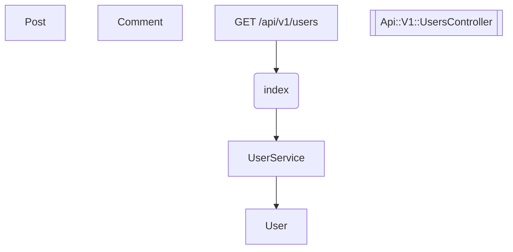

# Blog Sample - RailsFlowMap実例

このディレクトリには、RailsFlowMapの実際の使用例としてブログAPIアプリケーションのサンプルが含まれています。

## 📖 概要

**Blog Sample**は、RailsFlowMapがどのように実際のRailsアプリケーションを解析し、可視化するかを示すための完全なサンプルプロジェクトです。

### 🏗️ アーキテクチャ

**モデル構造**:
```
User ←→ Post ←→ Comment
 ↓       ↓       ↓
Profile  Category Tag
 ↓       ↓       ↓ 
Like    PostTag  UserFollowing
```

**API エンドポイント**:
- `GET /api/v1/users` - ユーザー一覧
- `POST /api/v1/users` - ユーザー作成
- `GET /api/v1/posts` - 投稿一覧  
- `POST /api/v1/posts` - 投稿作成
- `GET /api/v1/posts/:post_id/comments` - コメント一覧
- `POST /api/v1/posts/:post_id/comments` - コメント作成
- `GET /api/v1/analytics/users` - ユーザー分析
- `GET /api/v1/analytics/posts` - 投稿分析

## 📁 ディレクトリ構造

```
blog_sample/
├── README.md                 # このファイル
├── blog_sample/              # メインアプリケーション
│   ├── Gemfile              # gem依存関係
│   ├── app/                 # アプリケーションコード
│   │   ├── controllers/     # API コントローラー
│   │   │   └── api/v1/      # API v1 エンドポイント
│   │   ├── models/          # ActiveRecord モデル
│   │   └── services/        # ビジネスロジック層
│   ├── config/              # 設定ファイル
│   │   ├── initializers/    # RailsFlowMap設定
│   │   └── routes.rb        # ルート定義
│   └── lib/                 # ライブラリとヘルパー
│       └── mock_rails.rb    # テスト用Rails環境
└── *.rb                     # デモ・テストスクリプト
```

## 🎯 生成される可視化

### 1. アプリケーション全体フロー

RailsFlowMapにより以下が自動生成されます：

**Mermaidダイアグラム** (`doc/flow_maps/application_flow.md`):


### 2. エンドポイント固有フロー

**ユーザー一覧エンドポイント** (`/api/v1/users`):
```
GET /api/v1/users → UsersController#index → UserService → User model
```

### 3. モデル関係図

**PlantUMLダイアグラム**で以下の関係を可視化：
- User has_many :posts, :comments, :likes
- Post belongs_to :user, has_many :comments
- Comment belongs_to :user, :post

## 🚀 実行方法

### 基本テスト
```bash
cd blog_sample/blog_sample
ruby test_rails_flow_map.rb
```

### サンプルデモ実行
```bash
cd blog_sample
ruby test_sample_demo.rb
```

### Rake タスクシミュレーション
```bash
# プロジェクトルートから
ruby simulate_rake_tasks.rb
```

## 📊 出力例

実行後、以下のファイルが `doc/flow_maps/` に生成されます：

- **`application_flow.md`** (3,072文字) - 完全フローダイアグラム
- **`application_models.puml`** (1,244文字) - UMLモデル図
- **`application_graph.dot`** (3,272文字) - GraphViz詳細グラフ
- **`endpoint_users_flow.md`** (705文字) - ユーザーエンドポイント固有

## 🎯 学習ポイント

このサンプルから学べること：

### 1. **リクエストフロー追跡**
APIエンドポイントから内部コンポーネントまでの完全な流れを可視化

### 2. **アーキテクチャ理解**
- コントローラー → サービス → モデル の階層構造
- RESTful API設計パターン
- 関心の分離（SOA: Service-Oriented Architecture）

### 3. **実装パターン**
- `UserService.fetch_active_users` - ビジネスロジック
- `Post.published.includes(:user)` - N+1問題回避
- `AnalyticsService` - 分析機能の分離

### 4. **可視化の価値**
- 新規メンバーのオンボーディング支援
- アーキテクチャ設計の検証
- リファクタリング計画の策定
- 技術負債の特定

## 💡 実際のプロジェクトでの応用

1. **既存Rails アプリに導入**:
   ```ruby
   # Gemfile
   gem 'rails-flow-map'
   ```

2. **初期設定**:
   ```bash
   rails generate rails_flow_map:install
   ```

3. **解析実行**:
   ```bash
   rake rails_flow_map:generate
   rake rails_flow_map:endpoint['/api/users']
   ```

4. **ドキュメント化**:
   生成されたMermaid図をREADMEやWikiに貼り付け

## 🔍 カスタマイズ例

```ruby
# config/initializers/rails_flow_map.rb
RailsFlowMap.configure do |config|
  config.include_models = true
  config.include_controllers = true  
  config.include_routes = true
  config.output_dir = 'doc/architecture'
  config.default_format = :mermaid
end
```

---

このサンプルは、RailsFlowMapの実用性と、実際のアプリケーション開発でどれほど有用かを実証するための包括的な例です。