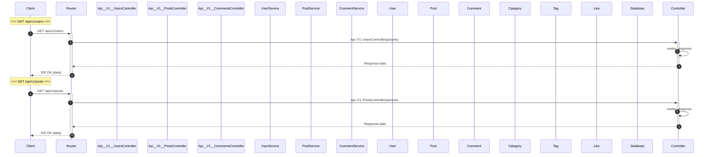

```mermaid
sequenceDiagram
    autonumber
    participant Client
    participant Router
    participant Api__V1__UsersController
    participant Api__V1__PostsController
    participant Api__V1__CommentsController
    participant UserService
    participant PostService
    participant CommentService
    participant User
    participant Post
    participant Comment
    participant Category
    participant Tag
    participant Like
    participant Database

    Note over Client: === GET /api/v1/users ===
    Client->>+Router: GET /api/v1/users
    Router->>+Controller: Api::V1::UsersController(params)
    Controller->>Controller: render_response
    Controller-->>-Router: Response data
    Router-->>-Client: 200 OK {data}

    Note over Client: === GET /api/v1/posts ===
    Client->>+Router: GET /api/v1/posts
    Router->>+Controller: Api::V1::PostsController(params)
    Controller->>Controller: render_response
    Controller-->>-Router: Response data
    Router-->>-Client: 200 OK {data}
```