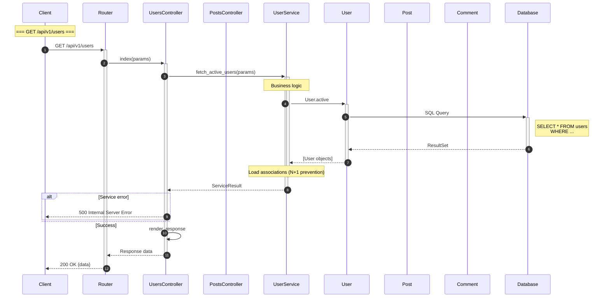

```mermaid
sequenceDiagram
    autonumber
    participant Client
    participant Router
    participant UsersController
    participant PostsController
    participant UserService
    participant User
    participant Post
    participant Comment
    participant Database

    Note over Client: === GET /api/v1/users ===
    Client->>+Router: GET /api/v1/users
    Router->>+UsersController: index(params)
    UsersController->>+UserService: fetch_active_users(params)
    activate UserService
    Note over UserService: Business logic
    UserService->>+User: User.active
    User->>+Database: SQL Query
    Note right of Database: SELECT * FROM users<br/>WHERE ...
    Database-->>-User: ResultSet
    User-->>-UserService: [User objects]
    Note over UserService: Load associations (N+1 prevention)
    deactivate UserService
    UserService-->>-UsersController: ServiceResult
    alt Service error
        UsersController-->>Client: 500 Internal Server Error
    else Success
    end
    UsersController->>UsersController: render_response
    UsersController-->>-Router: Response data
    Router-->>-Client: 200 OK {data}
```