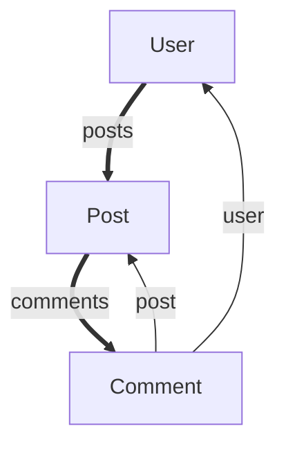
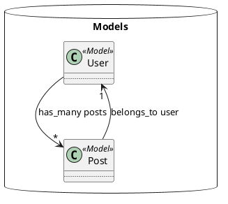
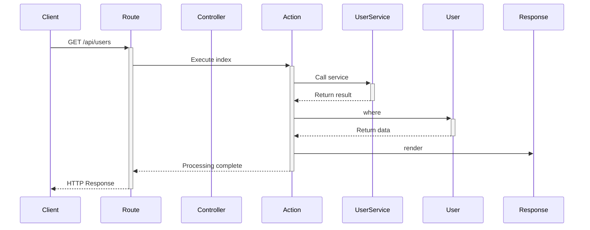

# RailsFlowMap

RailsFlowMap は Rails アプリケーションのデータフローを可視化するツールです。モデル間の関連やコントローラーの構造を解析し、Mermaid、PlantUML、GraphViz 形式での図表を生成します。

## 特徴

- **モデル関連の可視化**: belongs_to、has_many などの ActiveRecord アソシエーションを自動検出
- **コントローラー構造の解析**: コントローラーとアクションの関係を可視化
- **エンドポイントフロー追跡**: 特定のAPIエンドポイントのリクエスト処理フローを可視化
- **ルーティング解析**: Rails routes を解析してエンドポイント→コントローラー→モデルの流れを追跡
- **シーケンス図生成**: リクエストの処理順序をシーケンス図で表示
- **API ドキュメント自動生成**: エンドポイント毎の詳細ドキュメントを自動生成
- **複数フォーマット対応**: Mermaid、PlantUML、GraphViz DOT 形式で出力
- **カスタマイズ可能**: 設定ファイルで解析対象や出力形式をカスタマイズ
- **Rails 統合**: Rake タスクやジェネレーターで簡単に使用

## インストール

Gemfile に以下を追加：

```ruby
gem 'rails-flow-map'
```

そして実行：

```bash
$ bundle install
$ rails generate rails_flow_map:install
```

## 使用方法

### 基本的な使用方法

```bash
# 全体のフローマップを生成（Mermaid形式）
$ rake rails_flow_map:generate

# ファイルに出力
$ rake rails_flow_map:generate[mermaid,doc/flow_maps/app_flow.md]

# モデル関係のみを可視化
$ rake rails_flow_map:models[plantuml,doc/flow_maps/models.puml]

# コントローラー構造のみを可視化
$ rake rails_flow_map:controllers[graphviz,doc/flow_maps/controllers.dot]

# 特定のエンドポイントのフローを可視化
$ rake rails_flow_map:endpoint['/api/users',sequence,doc/flow_maps/users_endpoint.md]

# 全エンドポイントのシーケンス図を生成
$ rake rails_flow_map:sequence[doc/flow_maps/all_sequences.md]

# APIドキュメントを自動生成
$ rake rails_flow_map:api_docs[doc/api_documentation.md]
```

### プログラムからの使用

```ruby
# グラフを解析
graph = RailsFlowMap.analyze

# Mermaid形式で出力
mermaid_output = RailsFlowMap.export(graph, format: :mermaid)
puts mermaid_output

# ファイルに保存
RailsFlowMap.export(graph, format: :plantuml, output: 'models.puml')

# 特定のエンドポイントを解析
endpoint_graph = RailsFlowMap.analyze_endpoint('/api/users')
sequence_output = RailsFlowMap.export(endpoint_graph, format: :sequence, endpoint: '/api/users')
puts sequence_output
```

### 設定

`config/initializers/rails_flow_map.rb` で設定をカスタマイズできます：

```ruby
RailsFlowMap.configure do |config|
  # 除外するパス
  config.exclude_paths = ['app/models/concerns']
  
  # デフォルトの出力形式
  config.default_format = :mermaid
  
  # 出力ディレクトリ
  config.output_directory = 'doc/flow_maps'
end
```

## 出力例

### Mermaid形式



### PlantUML形式



## 利用可能なコマンド

| コマンド | 説明 |
|----------|------|
| `rails_flow_map:generate` | 完全なフローマップを生成 |
| `rails_flow_map:models` | モデル関係のみを生成 |
| `rails_flow_map:controllers` | コントローラー構造のみを生成 |
| `rails_flow_map:endpoint` | 特定のエンドポイントのフローを生成 |
| `rails_flow_map:sequence` | 全エンドポイントのシーケンス図を生成 |
| `rails_flow_map:api_docs` | APIドキュメントを自動生成 |
| `rails_flow_map:formats` | 利用可能な形式一覧を表示 |

## 対応形式

- **Mermaid**: GitHub、GitLab、Notion などで表示可能
- **PlantUML**: 詳細なUML図を生成  
- **GraphViz**: Graphviz ツールで高品質な図を生成
- **Sequence**: Mermaidシーケンス図形式
- **Request Flow**: リクエストフロー図
- **API Documentation**: 包括的なAPIドキュメント

## 開発

```bash
$ git clone https://github.com/asakura/rails-flow-map.git
$ cd rails-flow-map
$ bundle install
$ bundle exec rspec  # テスト実行
```

## ライセンス

MIT License の下で公開されています。詳細は [LICENSE.txt](LICENSE.txt) を参照してください。

## 貢献

バグレポートやプルリクエストは GitHub で受け付けています: https://github.com/asakura/rails-flow-map

## エンドポイントフロー可視化の例

### 特定のエンドポイントのシーケンス図

```bash
rake rails_flow_map:endpoint['/api/users',sequence]
```



### リクエストフロー図

```bash
rake rails_flow_map:endpoint['/api/users',request_flow]
```

これにより、特定のAPIエンドポイントに対するリクエストが、どのコントローラー、アクション、モデルを経由して処理されるかが一目で理解できます。

## 今後の機能

- [ ] データベースマイグレーション履歴の表示
- [ ] カスタムアソシエーションの対応
- [ ] Webインターフェース
- [ ] エクスポート形式の追加（SVG、PDF など）
- [ ] パフォーマンスメトリクスの統合
- [ ] リアルタイムリクエスト追跡