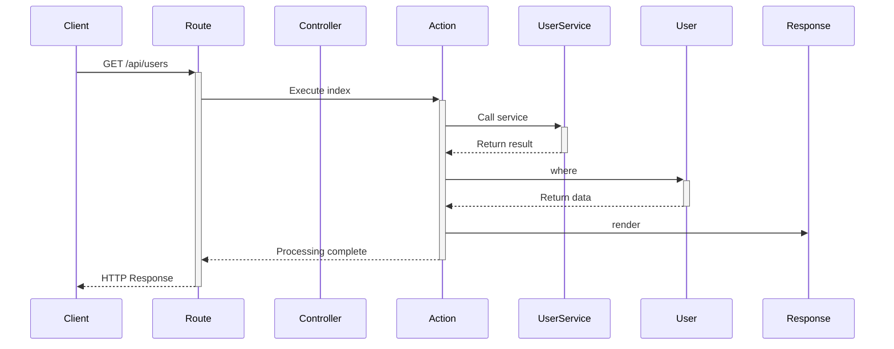
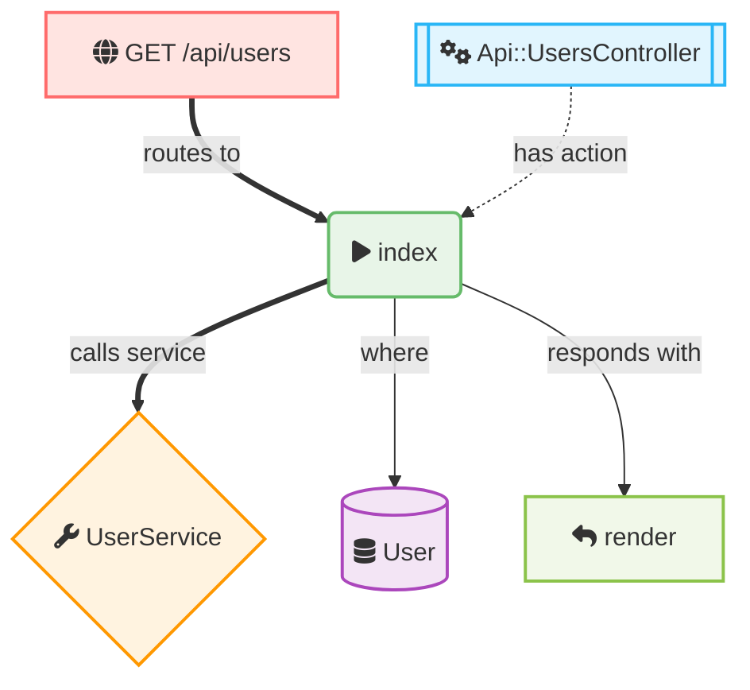

# エンドポイントフロー例: GET /api/users

この例は `GET /api/users` エンドポイントへのリクエストがどのように処理されるかを示しています。

## シーケンス図



## リクエストフロー図



## 詳細な処理フロー

1. **リクエスト受信**
   - クライアントから `GET /api/users` リクエストが送信される
   - Railsルーターがリクエストを受信

2. **ルーティング**
   - ルーターが `/api/users` パスを `Api::UsersController#index` にマッピング
   - コントローラーのインスタンスが作成される

3. **コントローラー処理**
   - `Api::UsersController` の `index` アクションが実行される
   - 必要に応じて認証・認可チェック

4. **サービス呼び出し**
   - `UserService` を呼び出してビジネスロジックを実行
   - データの変換や追加の処理を行う

5. **モデル操作**
   - `User` モデルに対してデータベースクエリを実行
   - `User.where(...)` などでデータを取得

6. **レスポンス生成**
   - 取得したデータをJSON形式でレンダリング
   - HTTPレスポンスとしてクライアントに送信

## コード例

```ruby
# routes.rb
Rails.application.routes.draw do
  namespace :api do
    resources :users, only: [:index]
  end
end

# app/controllers/api/users_controller.rb
class Api::UsersController < ApplicationController
  def index
    users = UserService.fetch_active_users
    render json: users
  end
end

# app/services/user_service.rb
class UserService
  def self.fetch_active_users
    User.where(active: true)
        .includes(:profile)
        .order(:created_at)
  end
end

# app/models/user.rb
class User < ApplicationRecord
  has_one :profile
  scope :active, -> { where(active: true) }
end
```

この図表により、特定のエンドポイントに対するリクエストがシステム内でどのように処理されるかが視覚的に理解できます。