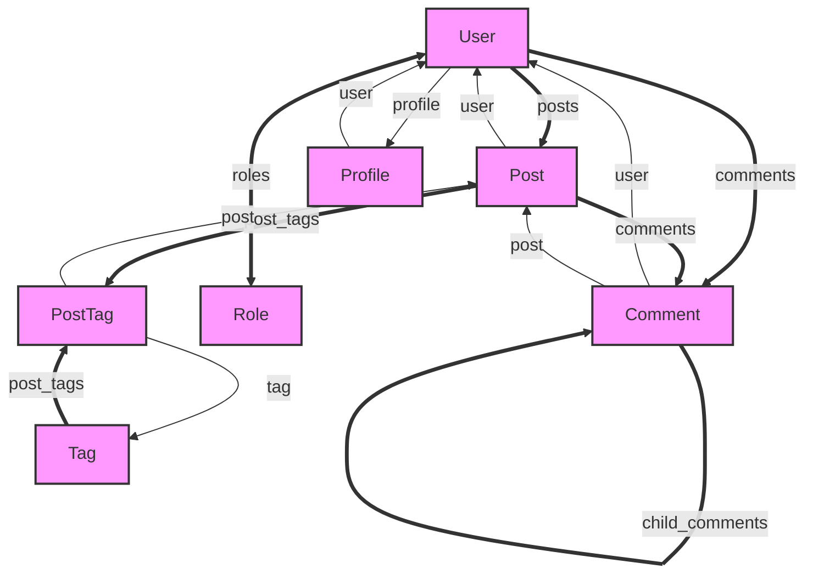

# Sample Mermaid Output

This is an example of the Mermaid format output generated by RailsFlowMap:

This diagram shows:
- **User** model as the central entity
- **One-to-many** relationships (==>) like User → Posts
- **Many-to-many** relationships (<===>) like User ↔ Roles  
- **One-to-one** relationships (-->) like User → Profile
- **Self-referential** relationships like Comment → parent_comment